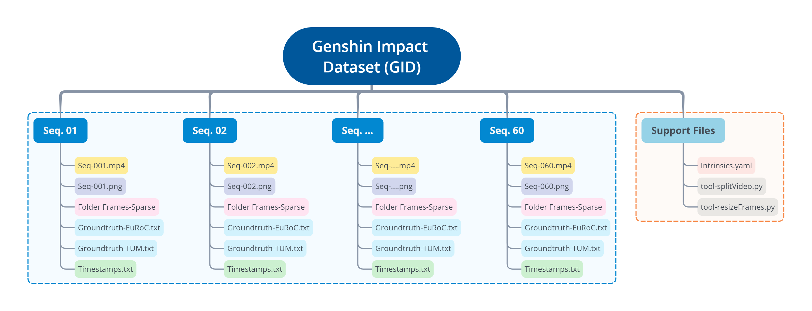
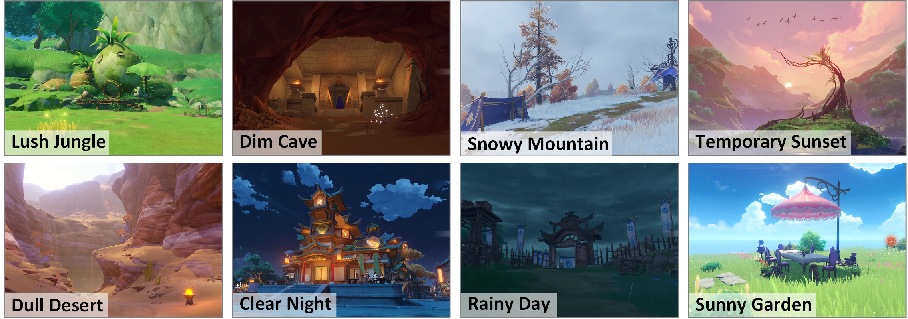
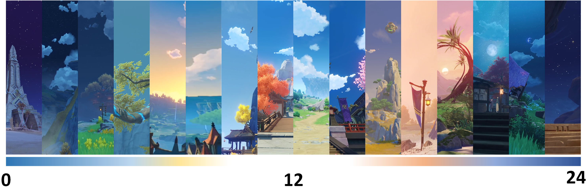
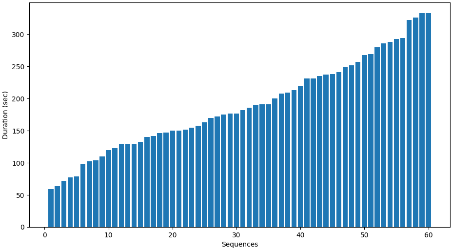
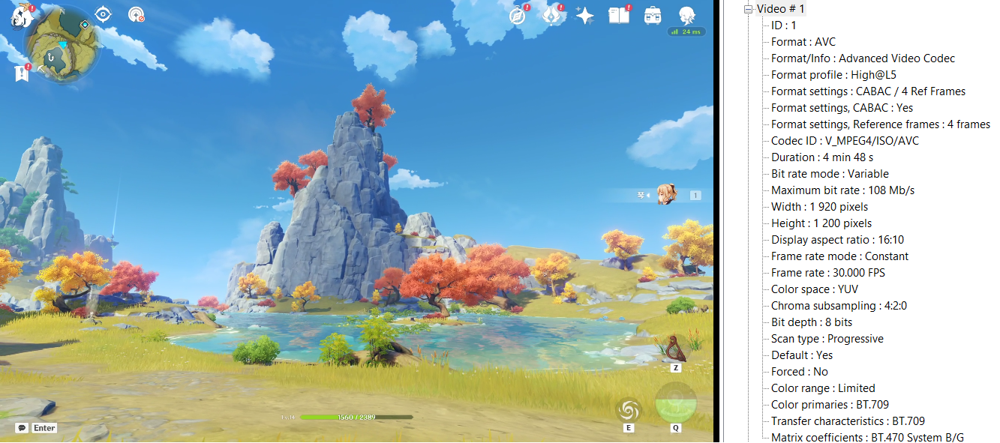
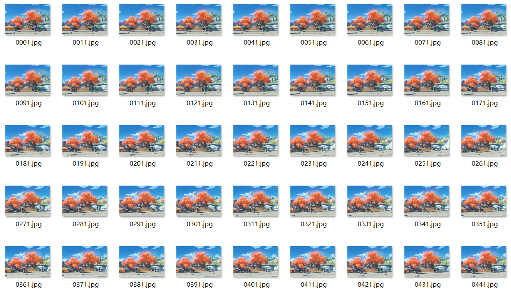
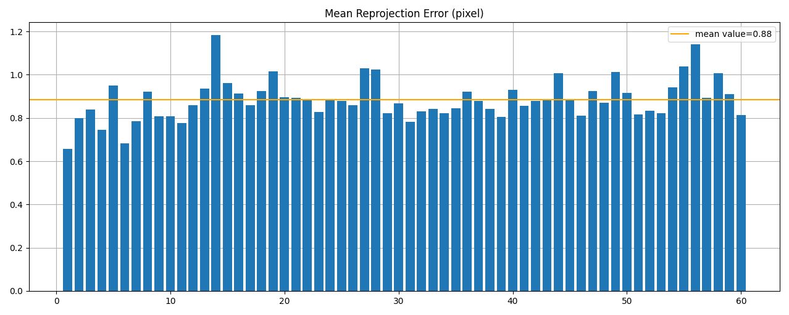

# The Genshin Impact Dataset (GID) for SLAM
The Genshin impact dataset (GID) is collected in the Genshin Impact game<a href="https://genshin.hoyoverse.com">[1]</a> for visual SLAM. It currently consists of 60 individual sequences (over 3 hours) and covers a wide range of scenes that are rare, hard, or dangerous for field collection in real world (such as dull deserts, dim caves, and lush jungles), providing great opportunities for SLAM evaluation and benchmark. Moreover, it includes a large number of visual challenges (such as low illumination) to test the robustness of various SLAM algorithms.

## 1. Dataset Organization
The dataset is generally composed of two parts: sequences (blue part) and support files (orange part), as the following figure shows.

**In the sequences part**, each sequence contains several files for the convenience of usage. We will take the Seq-001 as an example and elaborate next.

* **`Seq-001.mp4`**
The recorded video from the Genshin Impact game has a 1436×996 resolution at 30 FPS.

* **`Seq-001.png`**
The content preview of the recorded video for a fast grasp without playing it, which summarizes the resolution (width × height), duration (sec), FPS, and frames in total.

* **`Frames-Sparse`**
It is a folder storing split frames from the recorded video. For the convenience of end users, we split the whole video in advance with a frame interval of 10 (sample 1 frame every 10 frames).

* **`Groundtruth-EuRoC.txt`**
For the convenience of users, we provide groundtruth poses of split frames in both EuRoC and TUM format. This file records poses in EuRoC<a href="https://projects.asl.ethz.ch/datasets/doku.php?id=kmavvisualinertialdatasets">[2]</a> format:
    > timestamp[ns], pos_x[m], pos_y[m], pos_z[m], quat_w, quat_x, quat_y, quat_z

* **`Groundtruth-TUM.txt`**
This file records poses in TUM<a href="https://cvg.cit.tum.de/data/datasets/rgbd-dataset">[3]</a> format:
    > timestamp[s] pos_x[m] pos_y[m] pos_z[m] quat_x quat_y quat_z quat_w

* **`Timestamps.txt`**
This file stores the corresponding timestamps of split frames in the recorded video. The unit is nanosecond (10^-9 second).

**In the support files part**, it contains camera intrinsics and tool scripts.

* **`Intrinsics.yaml`**
This file records the focal length (fx and fy) and principle point (cx and cy) for the dataset. The data is organized in standard yaml format, which is easy for data input and output.

* **`tool-splitVideo.py`**
This Python script is used for splitting the original video into separate frames according to user settings. The only launch parameter for this script is the video path that you want to process. As for the other parameters, users can set them in an interactive manner. All interactive parameters are summarized below:
  * **Clipping start time**: second, default: 0s
  * **Clipping end time**: second, default: whole video
  * **Sampling interval N**: sample one frame every N frame, default: output every frame
  * **Scale for output frame**: resize and save frame images, default: 1 for the original scale
  * **Type for output frame**: file type, default: .jpg
  * **Name format for frame**: select from Timestamp format (12 digits to represent timestamp in nanoseconds) and Frame index format (4 digits to represent frame index in the original video). Default: Timestamp format.

* **`tool-resizeFrames.py`**
This Python script is used for the resampling of existing frame images. It requires three launch parameters:
  * **Search folder**: the folder path of frames need to be processed
  * **Image type**: the type of images in the folder
  * **Scale**: the scale for resizing

## 2. Dataset Coverage
### 2.1 Collection Distribution
We collect sequences at different places in the Genshin Impact game to cover a wide range of scenes as much as possible. Generally, each country in the game (Mondstadt, Liyue, Inazuma, and Sumeru) has 15 sequences to reflect its unique features. More specifically, the sequences are distributed as follows:
* Sequence 1-15 are collected in Mondstadt
* Sequence 16-30 are collected in Liyue
* Sequence 31-45 are collected in Inazuma
* Sequence 46-60 are collected in Sumeru

The following figure shows the distribution of sequences in different regions. You may click the figure and zoom in to see the details since the world map is very large.

### 2.2 Sequence Diversity
Benifiting from the large and diverse game world, the sequences in GID also have a great diversity, which we summarize in the following aspects.

**Scene**
The dataset involves a wide range of scenes, including desert, cave, jungle, and so on. The following figure shows some type of scenes. For example, the user can test the robustness of their SLAM with dim cave scenes. 

**Time**
The sequences in GID generally cover a whole day, from morning to afternoon and night. This potentially enables experiments for SLAM in changing illumination condition. The following figure shows the coverage of a whole day.

**Weather**
The dataset includes various weather conditions, such as clear, cloudy, and raining scenes. The following figure shows some examples of different weather conditions.

**Visual Challenge for SLAM**
The dataset contains various visual challenges for SLAM algorithms, such as low-light, low-texture. Sequences of these challenges may boost the development and benchmark of visual SLAM in challenging environments. The following figure shows some representitative challenges in the dataset.

**Duration**
The sequences cover a wide range of durations, from 59 seconds (Seq-042) to 333 seconds (Seq-049 & Seq-058), which provides the potential to test the scability of SLAM. The following figure shows the distribution of sequences in different durations.

## 3. Downloads
We upload all 60 sequences and provide two ways to download the dataset: Google Drive and Baidu Netdisk. You can click [Google Drive](https://drive.google.com/drive/folders/1ha6UrQTV81JwI_4EBYTam3g1KYAPMosT?usp=drive_link) or [Baidu Netdisk](https://pan.baidu.com/s/17JGY9j_ZGXKJSLJd_MDK0Q?pwd=bsj7) for downloading the whole dataset (about 22 GB totally) according to your network environment, or you can download individual sequences by clicking corresponding links in the following table.

<table class="tg">
<thead>
  <tr>
    <th class="tg-baqh">Seq. No</th>
    <th class="tg-baqh">Region</th>
    <th class="tg-baqh">Duration (sec)</th>
    <th class="tg-baqh">Preview</th>
    <th class="tg-baqh">Google Drive</th>
    <th class="tg-baqh">Baidu Netdisk</th>
  </tr>
</thead>
<tbody>
  <tr>
  <td class="tg-baqh">Seq-001</td>
  <td class="tg-baqh">Mondstadt</td>
  <td class="tg-baqh">102</td>
  <td class="tg-baqh">
  
  </td>
  <td class="tg-baqh"><a href="https://drive.google.com/drive/folders/1JV5-c3_08DN1IrY7PEXZjvka3Gw6ckej?usp=drive_link">Link</a></td>
  <td class="tg-baqh"><a href="https://pan.baidu.com/s/1jseOBIsc1H7TaazPDg7Xig?pwd=kp29">Link</a></td>
  </tr>
  <tr>
  <td class="tg-baqh">Seq-002</td>
  <td class="tg-baqh">Mondstadt</td>
  <td class="tg-baqh">280</td>
  <td class="tg-baqh">
  
  </td>
  <td class="tg-baqh"><a href="https://drive.google.com/drive/folders/1eA9tKERpR5az1sjToXCJ6CDuXBNloN5M?usp=drive_link">Link</a></td>
  <td class="tg-baqh"><a href="https://pan.baidu.com/s/1cOoqEDTbzlXJyCSStR1nww?pwd=uzuw">Link</a></td>
  </tr>
  <tr>
  <td class="tg-baqh">Seq-003</td>
  <td class="tg-baqh">Mondstadt</td>
  <td class="tg-baqh">170</td>
  <td class="tg-baqh">
  
  </td>
  <td class="tg-baqh"><a href="https://drive.google.com/drive/folders/1GPWPV-MYeCgMBgA8qWQ-H5YNZGoa-jvJ?usp=drive_link">Link</a></td>
  <td class="tg-baqh"><a href="https://pan.baidu.com/s/1jwmT4BHTmk1_viCd-bdC2Q?pwd=ti4u">Link</a></td>
  </tr>
  <tr>
  <td class="tg-baqh">Seq-004</td>
  <td class="tg-baqh">Mondstadt</td>
  <td class="tg-baqh">120</td>
  <td class="tg-baqh">
  
  </td>
  <td class="tg-baqh"><a href="https://drive.google.com/drive/folders/1mSLn7zABwpwoW_daK844fTzPKgUyMn6g?usp=drive_link">Link</a></td>
  <td class="tg-baqh"><a href="https://pan.baidu.com/s/1EGbmVkIxhauvPpunqZ_1sg?pwd=r38o">Link</a></td>
  </tr>
  <tr>
  <td class="tg-baqh">Seq-005</td>
  <td class="tg-baqh">Mondstadt</td>
  <td class="tg-baqh">177</td>
  <td class="tg-baqh">
  
  </td>
  <td class="tg-baqh"><a href="https://drive.google.com/drive/folders/1hSxSW_zAGZNcaTvryIeAKRr9zum0occU?usp=drive_link">Link</a></td>
  <td class="tg-baqh"><a href="https://pan.baidu.com/s/1OCKAFoinHqbkN_6KNe87kQ?pwd=551n">Link</a></td>
  </tr>
  <tr>
  <td class="tg-baqh">Seq-006</td>
  <td class="tg-baqh">Mondstadt</td>
  <td class="tg-baqh">142</td>
  <td class="tg-baqh">
  
  </td>
  <td class="tg-baqh"><a href="https://drive.google.com/drive/folders/17n9aPc-CnrYpjWtVHRRsY1gIBJ-8EqQB?usp=drive_link">Link</a></td>
  <td class="tg-baqh"><a href="https://pan.baidu.com/s/1xvP1BxJbvXJ5Awk5glCm-g?pwd=0omz">Link</a></td>
  </tr>
  <tr>
  <td class="tg-baqh">Seq-007</td>
  <td class="tg-baqh">Mondstadt</td>
  <td class="tg-baqh">140</td>
  <td class="tg-baqh">
  
  </td>
  <td class="tg-baqh"><a href="https://drive.google.com/drive/folders/1H3OJLEtDO05uoEJTUDoheXzQmloafuGe?usp=drive_link">Link</a></td>
  <td class="tg-baqh"><a href="https://pan.baidu.com/s/1NcLh1Sq1-RD0tjktaf2Ucg?pwd=bbhw">Link</a></td>
  </tr>
  <tr>
  <td class="tg-baqh">Seq-008</td>
  <td class="tg-baqh">Mondstadt</td>
  <td class="tg-baqh">130</td>
  <td class="tg-baqh">
  
  </td>
  <td class="tg-baqh"><a href="https://drive.google.com/drive/folders/1GjzGANm12lmBtxeWwrdbH1wouflmVK7-?usp=drive_link">Link</a></td>
  <td class="tg-baqh"><a href="https://pan.baidu.com/s/1XUFzIh88BIh8ovupKBOkdA?pwd=vmom">Link</a></td>
  </tr>
  <tr>
  <td class="tg-baqh">Seq-009</td>
  <td class="tg-baqh">Mondstadt</td>
  <td class="tg-baqh">129</td>
  <td class="tg-baqh">
  
  </td>
  <td class="tg-baqh"><a href="https://drive.google.com/drive/folders/1ZPK8HelNZSs504yu8q8t-a4n2SIoZLQS?usp=drive_link">Link</a></td>
  <td class="tg-baqh"><a href="https://pan.baidu.com/s/1OoLSZuWxy1FAzYto14JH9g?pwd=fj8n">Link</a></td>
  </tr>
  <tr>
  <td class="tg-baqh">Seq-010</td>
  <td class="tg-baqh">Mondstadt</td>
  <td class="tg-baqh">182</td>
  <td class="tg-baqh">
  
  </td>
  <td class="tg-baqh"><a href="https://drive.google.com/drive/folders/1YXibfmOHPKooXaIgKMc2tRYsho5QA-Lb?usp=drive_link">Link</a></td>
  <td class="tg-baqh"><a href="https://pan.baidu.com/s/1DKPnahFZz8Xi6F4Qd_gWEg?pwd=75xe">Link</a></td>
  </tr>
  <tr>
  <td class="tg-baqh">Seq-011</td>
  <td class="tg-baqh">Mondstadt</td>
  <td class="tg-baqh">209</td>
  <td class="tg-baqh">
  
  </td>
  <td class="tg-baqh"><a href="https://drive.google.com/drive/folders/1KtLzPy2kuaT4iqdFchDlKX5lAQD_2F_6?usp=drive_link">Link</a></td>
  <td class="tg-baqh"><a href="https://pan.baidu.com/s/1BhN80y3xbSdgZXgwmqj2Gg?pwd=6m8j">Link</a></td>
  </tr>
  <tr>
  <td class="tg-baqh">Seq-012</td>
  <td class="tg-baqh">Mondstadt</td>
  <td class="tg-baqh">231</td>
  <td class="tg-baqh">
  
  </td>
  <td class="tg-baqh"><a href="https://drive.google.com/drive/folders/1IMoxZLpUPK1JUSCDias3x14qXH7ftyP6?usp=drive_link">Link</a></td>
  <td class="tg-baqh"><a href="https://pan.baidu.com/s/161GbWCt5rXiRBok0EORX6g?pwd=ttix">Link</a></td>
  </tr>
  <tr>
  <td class="tg-baqh">Seq-013</td>
  <td class="tg-baqh">Mondstadt</td>
  <td class="tg-baqh">123</td>
  <td class="tg-baqh">
  
  </td>
  <td class="tg-baqh"><a href="https://drive.google.com/drive/folders/14Un-OnDcs9plVUPZN1HeY6d1v6lI0kpR?usp=drive_link">Link</a></td>
  <td class="tg-baqh"><a href="https://pan.baidu.com/s/1739FtPqlRpbATLNUKMJC9A?pwd=e2wu">Link</a></td>
  </tr>
  <tr>
  <td class="tg-baqh">Seq-014</td>
  <td class="tg-baqh">Mondstadt</td>
  <td class="tg-baqh">150</td>
  <td class="tg-baqh">
  
  </td>
  <td class="tg-baqh"><a href="https://drive.google.com/drive/folders/1FNkLvOtcxsKjyaR1ErTY3cCSE7CIgTiQ?usp=drive_link">Link</a></td>
  <td class="tg-baqh"><a href="https://pan.baidu.com/s/1Eh6fiuSX9g0FCfAt3uUXbQ?pwd=ffvc">Link</a></td>
  </tr>
  <tr>
  <td class="tg-baqh">Seq-015</td>
  <td class="tg-baqh">Mondstadt</td>
  <td class="tg-baqh">293</td>
  <td class="tg-baqh">
  
  </td>
  <td class="tg-baqh"><a href="https://drive.google.com/drive/folders/1MqouSMMTx0-QNDdFPqHy109UGjL80mIi?usp=drive_link">Link</a></td>
  <td class="tg-baqh"><a href="https://pan.baidu.com/s/1xYNT3ta-u-BFkdFFE1wyCA?pwd=fkqo">Link</a></td>
  </tr>
  <tr>
  <td class="tg-baqh">Seq-016</td>
  <td class="tg-baqh">Liyue</td>
  <td class="tg-baqh">294</td>
  <td class="tg-baqh">
  
  </td>
  <td class="tg-baqh"><a href="https://drive.google.com/drive/folders/1jKpa3wXuJc7yEETSzrEEjMp64zjvRRc9?usp=drive_link">Link</a></td>
  <td class="tg-baqh"><a href="https://pan.baidu.com/s/1jDDhkDb1oq3AMKqLu984xw?pwd=769k">Link</a></td>
  </tr>
  <tr>
  <td class="tg-baqh">Seq-017</td>
  <td class="tg-baqh">Liyue</td>
  <td class="tg-baqh">191</td>
  <td class="tg-baqh">
  
  </td>
  <td class="tg-baqh"><a href="https://drive.google.com/drive/folders/1uoR3E1CMHPfYCj5HpFMeiB0Ljb-m5XGo?usp=drive_link">Link</a></td>
  <td class="tg-baqh"><a href="https://pan.baidu.com/s/1BYJBzRhV-2I3F5h4-FpJQw?pwd=np1o">Link</a></td>
  </tr>
  <tr>
  <td class="tg-baqh">Seq-018</td>
  <td class="tg-baqh">Liyue</td>
  <td class="tg-baqh">288</td>
  <td class="tg-baqh">
  
  </td>
  <td class="tg-baqh"><a href="https://drive.google.com/drive/folders/13kIVeA3lXfURG5XmEKeoCx07oXwLNs1h?usp=drive_link">Link</a></td>
  <td class="tg-baqh"><a href="https://pan.baidu.com/s/1E6SfrBxOOVHGysbc8Z7elg?pwd=ujet">Link</a></td>
  </tr>
  <tr>
  <td class="tg-baqh">Seq-019</td>
  <td class="tg-baqh">Liyue</td>
  <td class="tg-baqh">175</td>
  <td class="tg-baqh">
  
  </td>
  <td class="tg-baqh"><a href="https://drive.google.com/drive/folders/18RUvttdN2k9pX0dhZzgCqDS1_jZr3gok?usp=drive_link">Link</a></td>
  <td class="tg-baqh"><a href="https://pan.baidu.com/s/1rEHlyt6MdHiLDb5PtVlvkw?pwd=u6ke">Link</a></td>
  </tr>
  <tr>
  <td class="tg-baqh">Seq-020</td>
  <td class="tg-baqh">Liyue</td>
  <td class="tg-baqh">177</td>
  <td class="tg-baqh">
  
  </td>
  <td class="tg-baqh"><a href="https://drive.google.com/drive/folders/1tz5KJu78JuvW71-skTe5pVufZtk2OFSC?usp=drive_link">Link</a></td>
  <td class="tg-baqh"><a href="https://pan.baidu.com/s/1ADBQB8Oz8dsHKJyD6R1yTw?pwd=ijof">Link</a></td>
  </tr>
  <tr>
  <td class="tg-baqh">Seq-021</td>
  <td class="tg-baqh">Liyue</td>
  <td class="tg-baqh">322</td>
  <td class="tg-baqh">
  
  </td>
  <td class="tg-baqh"><a href="https://drive.google.com/drive/folders/1FAQhRnCw7i0GsWoKGbnTVgrt0VS6HiAe?usp=drive_link">Link</a></td>
  <td class="tg-baqh"><a href="https://pan.baidu.com/s/1e_AzZpJjnryU4TcbFiPEiQ?pwd=0c6k">Link</a></td>
  </tr>
  <tr>
  <td class="tg-baqh">Seq-022</td>
  <td class="tg-baqh">Liyue</td>
  <td class="tg-baqh">238</td>
  <td class="tg-baqh">
  
  </td>
  <td class="tg-baqh"><a href="https://drive.google.com/drive/folders/1fYxQw8NhR6ift8Rgqb1dc__-75g5darv?usp=drive_link">Link</a></td>
  <td class="tg-baqh"><a href="https://pan.baidu.com/s/15iwyd8yDfK-vSlC_JNn-hA?pwd=qxjr">Link</a></td>
  </tr>
  <tr>
  <td class="tg-baqh">Seq-023</td>
  <td class="tg-baqh">Liyue</td>
  <td class="tg-baqh">158</td>
  <td class="tg-baqh">
  
  </td>
  <td class="tg-baqh"><a href="https://drive.google.com/drive/folders/14ZsVzmJoneLGX2zEkYdLxZEXj8Yki-lT?usp=drive_link">Link</a></td>
  <td class="tg-baqh"><a href="https://pan.baidu.com/s/1xikiLmM6DGQaAUMbEbPYVQ?pwd=aodj">Link</a></td>
  </tr>
  <tr>
  <td class="tg-baqh">Seq-024</td>
  <td class="tg-baqh">Liyue</td>
  <td class="tg-baqh">163</td>
  <td class="tg-baqh">
  
  </td>
  <td class="tg-baqh"><a href="https://drive.google.com/drive/folders/1rxHqVlyFww3SKl6CQRJyTLr5cAGAdoSa?usp=drive_link">Link</a></td>
  <td class="tg-baqh"><a href="https://pan.baidu.com/s/1h-3KYYwb6GPJYZ_cgvBinw?pwd=9vun">Link</a></td>
  </tr>
  <tr>
  <td class="tg-baqh">Seq-025</td>
  <td class="tg-baqh">Liyue</td>
  <td class="tg-baqh">241</td>
  <td class="tg-baqh">
  
  </td>
  <td class="tg-baqh"><a href="https://drive.google.com/drive/folders/13mRk6GFKIwDDm42l1jCP7dLe6Qm4t1HL?usp=drive_link">Link</a></td>
  <td class="tg-baqh"><a href="https://pan.baidu.com/s/1hQoyk6T5uxMuWwRtOpyhXQ?pwd=dopf">Link</a></td>
  </tr>
  <tr>
  <td class="tg-baqh">Seq-026</td>
  <td class="tg-baqh">Liyue</td>
  <td class="tg-baqh">326</td>
  <td class="tg-baqh">
  
  </td>
  <td class="tg-baqh"><a href="https://drive.google.com/drive/folders/1otANqnds0hMbVtyXW8JiVnBe9HpWhit1?usp=drive_link">Link</a></td>
  <td class="tg-baqh"><a href="https://pan.baidu.com/s/1HxYIRKj5uCsKZUCWvaZfYw?pwd=q3l9">Link</a></td>
  </tr>
  <tr>
  <td class="tg-baqh">Seq-027</td>
  <td class="tg-baqh">Liyue</td>
  <td class="tg-baqh">257</td>
  <td class="tg-baqh">
  
  </td>
  <td class="tg-baqh"><a href="https://drive.google.com/drive/folders/1jfUNkXIlqwA5aEStsN8KDgQIM6U3Cbk4?usp=drive_link">Link</a></td>
  <td class="tg-baqh"><a href="https://pan.baidu.com/s/18DsVrNDnb7LrVPCIYo_oaw?pwd=7ctj">Link</a></td>
  </tr>
  <tr>
  <td class="tg-baqh">Seq-028</td>
  <td class="tg-baqh">Liyue</td>
  <td class="tg-baqh">104</td>
  <td class="tg-baqh">
  
  </td>
  <td class="tg-baqh"><a href="https://drive.google.com/drive/folders/1_2Fpy1bANeRqEhai7gCRMh7pRq068rBC?usp=drive_link">Link</a></td>
  <td class="tg-baqh"><a href="https://pan.baidu.com/s/1oga25bdBy1ciHQzgHlgnwA?pwd=epma">Link</a></td>
  </tr>
  <tr>
  <td class="tg-baqh">Seq-029</td>
  <td class="tg-baqh">Liyue</td>
  <td class="tg-baqh">286</td>
  <td class="tg-baqh">
  
  </td>
  <td class="tg-baqh"><a href="https://drive.google.com/drive/folders/1OS2Ag29lUh21mCBsZATamlxeLxfj-KKe?usp=drive_link">Link</a></td>
  <td class="tg-baqh"><a href="https://pan.baidu.com/s/15V32LPWeCa4PPE_Sed10fw?pwd=7he6">Link</a></td>
  </tr>
  <tr>
  <td class="tg-baqh">Seq-030</td>
  <td class="tg-baqh">Liyue</td>
  <td class="tg-baqh">269</td>
  <td class="tg-baqh">
  
  </td>
  <td class="tg-baqh"><a href="https://drive.google.com/drive/folders/1_hYkao4uGhj2hsCCMJlEUHaJgKw_q06r?usp=drive_link">Link</a></td>
  <td class="tg-baqh"><a href="https://pan.baidu.com/s/1bmWspF-mBXbovxusd3lkrQ?pwd=gt8l">Link</a></td>
  </tr>
  <tr>
  <td class="tg-baqh">Seq-031</td>
  <td class="tg-baqh">Inazuma</td>
  <td class="tg-baqh">172</td>
  <td class="tg-baqh">
  
  </td>
  <td class="tg-baqh"><a href="https://drive.google.com/drive/folders/1rY65PN5dOgFQpWxBxHQQwrip3uWYTqUS?usp=sharing">Link</a></td>
  <td class="tg-baqh"><a href="https://pan.baidu.com/s/1ERTN8WsmKZOI5Ck-wfKEig?pwd=cjmu">Link</a></td>
  </tr>
  <tr>
  <td class="tg-baqh">Seq-032</td>
  <td class="tg-baqh">Inazuma</td>
  <td class="tg-baqh">110</td>
  <td class="tg-baqh">
  
  </td>
  <td class="tg-baqh"><a href="https://drive.google.com/drive/folders/1Tta3QmlMc4BReTi3sW6CAoSIO_E6Uv0X?usp=sharing">Link</a></td>
  <td class="tg-baqh"><a href="https://pan.baidu.com/s/1XFsOzARffaZYGEzbOMVVgg?pwd=8dtl">Link</a></td>
  </tr>
  <tr>
  <td class="tg-baqh">Seq-033</td>
  <td class="tg-baqh">Inazuma</td>
  <td class="tg-baqh">249</td>
  <td class="tg-baqh">
  
  </td>
  <td class="tg-baqh"><a href="https://drive.google.com/drive/folders/1kGPMStiwyYf4nA6tk2UnQbzIyKHwKwXq?usp=sharing">Link</a></td>
  <td class="tg-baqh"><a href="https://pan.baidu.com/s/1BauYQyuDkQljSqq1UsXevw?pwd=xgf0">Link</a></td>
  </tr>
  <tr>
  <td class="tg-baqh">Seq-034</td>
  <td class="tg-baqh">Inazuma</td>
  <td class="tg-baqh">77</td>
  <td class="tg-baqh">
  
  </td>
  <td class="tg-baqh"><a href="https://drive.google.com/drive/folders/1IZ-TshADkAucdfFwW8y44dQ410g-6sCv?usp=sharing">Link</a></td>
  <td class="tg-baqh"><a href="https://pan.baidu.com/s/1RO79qy2bJMehCq69kdcLpQ?pwd=rz2y">Link</a></td>
  </tr>
  <tr>
  <td class="tg-baqh">Seq-035</td>
  <td class="tg-baqh">Inazuma</td>
  <td class="tg-baqh">268</td>
  <td class="tg-baqh">
  
  </td>
  <td class="tg-baqh"><a href="https://drive.google.com/drive/folders/1uD4P3AubSmin2tkeIHEFb95hb8mQSira?usp=sharing">Link</a></td>
  <td class="tg-baqh"><a href="https://pan.baidu.com/s/1XCQEvQtEupJxKxv8qnSdRw?pwd=cr0r">Link</a></td>
  </tr>
  <tr>
  <td class="tg-baqh">Seq-036</td>
  <td class="tg-baqh">Inazuma</td>
  <td class="tg-baqh">235</td>
  <td class="tg-baqh">
  
  </td>
  <td class="tg-baqh"><a href="https://drive.google.com/drive/folders/1VjPkVKQb1x5hrfpatq8P94ATQ9rmzDIE?usp=sharing">Link</a></td>
  <td class="tg-baqh"><a href="https://pan.baidu.com/s/1khsX3vciiVahzFbFiN6EWw?pwd=9yfi">Link</a></td>
  </tr>
  <tr>
  <td class="tg-baqh">Seq-037</td>
  <td class="tg-baqh">Inazuma</td>
  <td class="tg-baqh">152</td>
  <td class="tg-baqh">
  
  </td>
  <td class="tg-baqh"><a href="https://drive.google.com/drive/folders/1Uig8W2IVZuZ0UcI6fFlBRlbU9AGPREkZ?usp=sharing">Link</a></td>
  <td class="tg-baqh"><a href="https://pan.baidu.com/s/1BGbI_RWOagHsr5zqjqGmAA?pwd=cly8">Link</a></td>
  </tr>
  <tr>
  <td class="tg-baqh">Seq-038</td>
  <td class="tg-baqh">Inazuma</td>
  <td class="tg-baqh">252</td>
  <td class="tg-baqh">
  
  </td>
  <td class="tg-baqh"><a href="https://drive.google.com/drive/folders/1_RBpFqNT12oEooBXwTSx3V1hUSEj4sDa?usp=sharing">Link</a></td>
  <td class="tg-baqh"><a href="https://pan.baidu.com/s/1c-KZETvXPVJuqkHyddSuDg?pwd=unls">Link</a></td>
  </tr>
  <tr>
  <td class="tg-baqh">Seq-039</td>
  <td class="tg-baqh">Inazuma</td>
  <td class="tg-baqh">231</td>
  <td class="tg-baqh">
  
  </td>
  <td class="tg-baqh"><a href="https://drive.google.com/drive/folders/1Iw0rZwYQvCvQqqSEnF_sWqxzR-Hjk3UK?usp=sharing">Link</a></td>
  <td class="tg-baqh"><a href="https://pan.baidu.com/s/1iHgWW8GRRH-UJLn_whcf7Q?pwd=aj0k">Link</a></td>
  </tr>
  <tr>
  <td class="tg-baqh">Seq-040</td>
  <td class="tg-baqh">Inazuma</td>
  <td class="tg-baqh">98</td>
  <td class="tg-baqh">
  
  </td>
  <td class="tg-baqh"><a href="https://drive.google.com/drive/folders/1iopHzXcNhm_i7EYns_h19nIVrzNto-IB?usp=sharing">Link</a></td>
  <td class="tg-baqh"><a href="https://pan.baidu.com/s/1ipF5cgN9M9Q2hAjjaJtujQ?pwd=lv8z">Link</a></td>
  </tr>
  <tr>
  <td class="tg-baqh">Seq-041</td>
  <td class="tg-baqh">Inazuma</td>
  <td class="tg-baqh">129</td>
  <td class="tg-baqh">
  
  </td>
  <td class="tg-baqh"><a href="https://drive.google.com/drive/folders/1LpCTfDPSVS4wV-VgRc673NGnphH_Ox7h?usp=sharing">Link</a></td>
  <td class="tg-baqh"><a href="https://pan.baidu.com/s/1MV1PHqZsi1xO_pA_axJrUw?pwd=0oj2">Link</a></td>
  </tr>
  <tr>
  <td class="tg-baqh">Seq-042</td>
  <td class="tg-baqh">Inazuma</td>
  <td class="tg-baqh">59</td>
  <td class="tg-baqh">
  
  </td>
  <td class="tg-baqh"><a href="https://drive.google.com/drive/folders/1fjY9GI_jSFBFhkeS9KNTrF_oetwZaVrc?usp=sharing">Link</a></td>
  <td class="tg-baqh"><a href="https://pan.baidu.com/s/18KPVIGa3wXAzT7wmd_tfHA?pwd=2r35">Link</a></td>
  </tr>
  <tr>
  <td class="tg-baqh">Seq-043</td>
  <td class="tg-baqh">Inazuma</td>
  <td class="tg-baqh">133</td>
  <td class="tg-baqh">
  
  </td>
  <td class="tg-baqh"><a href="https://drive.google.com/drive/folders/109bW9fbWLj3ohDowwtpW-CtakKvjIqLq?usp=sharing">Link</a></td>
  <td class="tg-baqh"><a href="https://pan.baidu.com/s/1BPIYCfv1DD-vWnW0BUggDw?pwd=oxg8">Link</a></td>
  </tr>
  <tr>
  <td class="tg-baqh">Seq-044</td>
  <td class="tg-baqh">Inazuma</td>
  <td class="tg-baqh">155</td>
  <td class="tg-baqh">
  
  </td>
  <td class="tg-baqh"><a href="https://drive.google.com/drive/folders/1-ymOsHpanJZ7wIiaWTHQ2-jpfejiaChP?usp=sharing">Link</a></td>
  <td class="tg-baqh"><a href="https://pan.baidu.com/s/1dPuriCbrdhVefUrUwUj1PA?pwd=eqeg">Link</a></td>
  </tr>
  <tr>
  <td class="tg-baqh">Seq-045</td>
  <td class="tg-baqh">Inazuma</td>
  <td class="tg-baqh">64</td>
  <td class="tg-baqh">
  
  </td>
  <td class="tg-baqh"><a href="https://drive.google.com/drive/folders/1r3U_XDEZU-BDz058CTLBNgvGoIySaNXO?usp=sharing">Link</a></td>
  <td class="tg-baqh"><a href="https://pan.baidu.com/s/1g51Mt1TN8yn_L6GJdr-5kg?pwd=rdpx">Link</a></td>
  </tr>
  <tr>
  <td class="tg-baqh">Seq-046</td>
  <td class="tg-baqh">Sumeru</td>
  <td class="tg-baqh">72</td>
  <td class="tg-baqh">
  
  </td>
  <td class="tg-baqh"><a href="https://drive.google.com/drive/folders/1KADDyPa4nT8nNp_n81osjfnAj1-Q6rka?usp=drive_link">Link</a></td>
  <td class="tg-baqh"><a href="https://pan.baidu.com/s/12PMp6eA6mVIHJS4CvljdxA?pwd=4cjm">Link</a></td>
  </tr>
  <tr>
  <td class="tg-baqh">Seq-047</td>
  <td class="tg-baqh">Sumeru</td>
  <td class="tg-baqh">191</td>
  <td class="tg-baqh">
  
  </td>
  <td class="tg-baqh"><a href="https://drive.google.com/drive/folders/1ck6M16-UCTuaytjgsJfDqli57I6fN1QQ?usp=drive_link">Link</a></td>
  <td class="tg-baqh"><a href="https://pan.baidu.com/s/1SmvoLz0sOGcQC3w0lKVk8g?pwd=vfn2">Link</a></td>
  </tr>
  <tr>
  <td class="tg-baqh">Seq-048</td>
  <td class="tg-baqh">Sumeru</td>
  <td class="tg-baqh">208</td>
  <td class="tg-baqh">
  
  </td>
  <td class="tg-baqh"><a href="https://drive.google.com/drive/folders/1w-74H56_B2Z2XLKDNi5ASVjggR2-HqT1?usp=drive_link">Link</a></td>
  <td class="tg-baqh"><a href="https://pan.baidu.com/s/1jxR4g7vtdXttf5RaGJTFKg?pwd=oi69">Link</a></td>
  </tr>
  <tr>
  <td class="tg-baqh">Seq-049</td>
  <td class="tg-baqh">Sumeru</td>
  <td class="tg-baqh">333</td>
  <td class="tg-baqh">
  
  </td>
  <td class="tg-baqh"><a href="https://drive.google.com/drive/folders/1GQFU2QIf93pw74NIVFOJhvSDwLWk6n3-?usp=drive_link">Link</a></td>
  <td class="tg-baqh"><a href="https://pan.baidu.com/s/1bWOT8YYBOo_I4CSzeKqqnA?pwd=q8eh">Link</a></td>
  </tr>
  <tr>
  <td class="tg-baqh">Seq-050</td>
  <td class="tg-baqh">Sumeru</td>
  <td class="tg-baqh">219</td>
  <td class="tg-baqh">
  
  </td>
  <td class="tg-baqh"><a href="https://drive.google.com/drive/folders/1ex5J7uNw-WIDU8wRIaqMFodX2VF0UBbD?usp=drive_link">Link</a></td>
  <td class="tg-baqh"><a href="https://pan.baidu.com/s/18SoDKAuXm0NZr4jyutrWLw?pwd=8jl1">Link</a></td>
  </tr>
  <tr>
  <td class="tg-baqh">Seq-051</td>
  <td class="tg-baqh">Sumeru</td>
  <td class="tg-baqh">146</td>
  <td class="tg-baqh">
  
  </td>
  <td class="tg-baqh"><a href="https://drive.google.com/drive/folders/1EJQe0fpCvMTHIeXrJeYn-ETfP3649HCs?usp=drive_link">Link</a></td>
  <td class="tg-baqh"><a href="https://pan.baidu.com/s/1DZcNMCBbK6I2bpmNtpTg4w?pwd=6uf2">Link</a></td>
  </tr>
  <tr>
  <td class="tg-baqh">Seq-052</td>
  <td class="tg-baqh">Sumeru</td>
  <td class="tg-baqh">237</td>
  <td class="tg-baqh">
  
  </td>
  <td class="tg-baqh"><a href="https://drive.google.com/drive/folders/1nIHDQQj2KFhcZfMRMHRovKXfQjHzAV0l?usp=drive_link">Link</a></td>
  <td class="tg-baqh"><a href="https://pan.baidu.com/s/1bmhIsQESSJTtV2_x9yKr-A?pwd=7cnd">Link</a></td>
  </tr>
  <tr>
  <td class="tg-baqh">Seq-053</td>
  <td class="tg-baqh">Sumeru</td>
  <td class="tg-baqh">147</td>
  <td class="tg-baqh">
  
  </td>
  <td class="tg-baqh"><a href="https://drive.google.com/drive/folders/1sxVudEF1ypxa21hh-AORhcXKWFJOiDtq?usp=drive_link">Link</a></td>
  <td class="tg-baqh"><a href="https://pan.baidu.com/s/16j0XZjFUNYt5sYED-3Yy6A?pwd=8fmj">Link</a></td>
  </tr>
  <tr>
  <td class="tg-baqh">Seq-054</td>
  <td class="tg-baqh">Sumeru</td>
  <td class="tg-baqh">213</td>
  <td class="tg-baqh">
  
  </td>
  <td class="tg-baqh"><a href="https://drive.google.com/drive/folders/16pO1HDp4kXmYYG79uUflAXfKkgoyvVY8?usp=drive_link">Link</a></td>
  <td class="tg-baqh"><a href="https://pan.baidu.com/s/1_LBfxHRYSPWWpkPymBvCag?pwd=o5k0">Link</a></td>
  </tr>
  <tr>
  <td class="tg-baqh">Seq-055</td>
  <td class="tg-baqh">Sumeru</td>
  <td class="tg-baqh">79</td>
  <td class="tg-baqh">
  
  </td>
  <td class="tg-baqh"><a href="https://drive.google.com/drive/folders/1oRGhpZ0MMl75Hj_G0vUDGY_CemM3MAUU?usp=drive_link">Link</a></td>
  <td class="tg-baqh"><a href="https://pan.baidu.com/s/1DZBHelUoZjbaPwrTSk2jhA?pwd=e2kj">Link</a></td>
  </tr>
  <tr>
  <td class="tg-baqh">Seq-056</td>
  <td class="tg-baqh">Sumeru</td>
  <td class="tg-baqh">186</td>
  <td class="tg-baqh">
  
  </td>
  <td class="tg-baqh"><a href="https://drive.google.com/drive/folders/16Y6o9NBRXisrqtm6uZD-zSOKKXei7z2i?usp=drive_link">Link</a></td>
  <td class="tg-baqh"><a href="https://pan.baidu.com/s/1SIkyRVJO5_siJQs0YOz7VA?pwd=do2c">Link</a></td>
  </tr>
  <tr>
  <td class="tg-baqh">Seq-057</td>
  <td class="tg-baqh">Sumeru</td>
  <td class="tg-baqh">150</td>
  <td class="tg-baqh">
  
  </td>
  <td class="tg-baqh"><a href="https://drive.google.com/drive/folders/1wQ3_3_UxSIzMLGXAfIKuKhSDiJN4TPSm?usp=drive_link">Link</a></td>
  <td class="tg-baqh"><a href="https://pan.baidu.com/s/1DELvkLxRm4IgSq_x6w_1xw?pwd=8dv0">Link</a></td>
  </tr>
  <tr>
  <td class="tg-baqh">Seq-058</td>
  <td class="tg-baqh">Sumeru</td>
  <td class="tg-baqh">333</td>
  <td class="tg-baqh">
  
  </td>
  <td class="tg-baqh"><a href="https://drive.google.com/drive/folders/1f1lcE9uYnJ8Xpst0dMrSo1YJkpRETM-5?usp=drive_link">Link</a></td>
  <td class="tg-baqh"><a href="https://pan.baidu.com/s/1KRndy1j-8kxDfOqgqCGShA?pwd=51ht">Link</a></td>
  </tr>
  <tr>
  <td class="tg-baqh">Seq-059</td>
  <td class="tg-baqh">Sumeru</td>
  <td class="tg-baqh">200</td>
  <td class="tg-baqh">
  
  </td>
  <td class="tg-baqh"><a href="https://drive.google.com/drive/folders/1OvvtX1tBaIpM9futahSBwUhV4t725Y45?usp=drive_link">Link</a></td>
  <td class="tg-baqh"><a href="https://pan.baidu.com/s/1j6QP5z7n3Qypy5rxKsZLrQ?pwd=3w27">Link</a></td>
  </tr>
  <tr>
  <td class="tg-baqh">Seq-060</td>
  <td class="tg-baqh">Sumeru</td>
  <td class="tg-baqh">190</td>
  <td class="tg-baqh">
  
  </td>
  <td class="tg-baqh"><a href="">Link</a></td>
  <td class="tg-baqh"><a href="https://pan.baidu.com/s/14W0rOPCjwuHFOFPaW3RHaQ?pwd=b1ql">Link</a></td>
  </tr>
</tbody>
</table>

## 4. Technical Details
### 4.1 Data Collection & Pre-processing
All the sequences are collected with fixed and consistent settings. The computer used for data collection is equipped with an Intel Core i9-9900K CPU, 64GB RAM, and an NVIDIA Titan RTX GPU. We first record videos from the Genshin Impact game, where the videos are saved in `.mkv` format. The original resolution of the video is 1920 × 1200 @ 30FPS, as the following figure shows.

Then, we write Python scripts to split the recorded videos into frames and save them in `.jpg` format, where we sample 1 frame every 10 frames. Moreover, we simultaneously crop the frame images to 1436 × 996 to remove unrelated parts in the original videos.

### 4.2 Groundtruth Estimation & Reconstruction
To obtain the precise poses of the camera, we use the ColMap software<a href="https://colmap.github.io">[4]</a> for groundtruth estimation and 3D reconstruction. We input all the frames of a sequence to ColMap and obtain the camera poses and 3D points. We use "automatic reconstruction" mode with the following parameters:
  * Data type: Video frames
  * Quality: Medium
  * Shared intrinsics: Yes
  * Sparse model: Yes
  * Dense model: Yes

For other parameters, we let ColMap manage them as default. The following figure shows the estimated camera poses and 3D points of the `Seq-046` sequence in ColMap.

We can also visualize reconstructed 3D meshes with MeshLab, as the following figure shows.

### 4.3 Post-processing
After reconstruction, we export the trajectory in ColMap to a `images.txt` file, which contains the estimated camera poses. We then write Python scripts to convert the `images.txt` file to  standard TUM and EuRoC format files. Moreover, we export the estimated camera intrinsics in ColMap to a `cameras.txt` file. 

## 5. SLAM Demos with GID
The following figure briefly demonstrates the performance of ORB-SLAM2<a href="https://github.com/raulmur/ORB_SLAM2">[5]</a> (monocular) on our dataset, which is a classic and sophisticated visual SLAM. For the best reading, you may click [here](./figures/orb-slam2-perf.mp4) to download and view the whole video of testing (50s).

Generally, the ORB-SLAM2 performs well in various scenes, even in some challenging scenes, demonstrating the feasibility of our dataset for running SLAM algorithms. For example, we compare the estimated trajectory for Seq-060 and the groundtruth poses with EVO tool<a href="https://github.com/MichaelGrupp/evo">[6]</a>, as the following figure shows.

After scale and trajectory alignment, it can be seen that the estimated poses are generally consistent with groundtruth. On the one side, this demonstrates the feasibility of our dataset, on the other side, this shows the high accuracy of groundtruth estimated by ColMap.

## 6. FAQs
### Q1: What are the features and advantages of the proposed dataset?
**Answer:**

* Compared with field collected data, our dataset contains more diverse scenes for SLAM to test. Moreover, many areas that are difficult or dangerous to collect in practice, such as the desert, the caves, and snow mountains.

* Compared with sequences collected in simulation environments, the proposed dataset has the following advantages.
  * The scenes are exquisite and beautiful in the Genshin Impact game, compared with existing simulation. Generally, few simulation software (such as Gazebo<a href="https://gazebosim.org">[7]</a>, XTDrone<a href="https://github.com/robin-shaun/XTDrone">[8]</a>) provides such exquisite scenes. Some sophisticated simulation software (such as AirSim<a href="https://microsoft.github.io/AirSim">[9]</a>, Nvidia Omniverse<a href="https://developer.nvidia.com/omniverse">[10]</a>) may provide exquisite scenes, but it is difficult to get involved and design your own world. 
  * It saves a lot of time and effort to build the scenes in simulation softwares. It is time-consuming and laborious to build a scene in simulation software from scratch, especially for large scenes. But we can directly collect sequences in the game, which is much easier and more efficient.
  * Existing simulation platforms are difficult to simulate visual challenges we wanted for SLAM tests. For example, XTDrone typically cannot simulate weather changes. However, recored sequences in the dataset contains photorealistic weather changes, such as sunny, rainy, snowy, and foggy.

### Q2: How the groundtruth poses are estimated? What is the accuracy? How you guarantee the reliability?
**Answer:**

* As we mentioned before, we use the ColMap software for the groundtruth pose estimation, which is a popular and sophisticated software for 3D reconstruction. We use the "automatic reconstruction" mode with medium quality to obtain the groundtruth poses. The estimated poses are generally accurate.

* Since we do not have the real poses of camera, we evaluate the accuracy of estimated groundtruth with reprojection error, which is automatically calculated and provided in ColMap software. The reprojections error indicates the average distance between the reprojected 3D points and the corresponding 2D points in the image. The following figure shows the corresponding reprojection error of each sequence in the dataset. Generally, the overall of all sequences is 0.884378 (less than 1 pixel), which is very small.

* We cannot obtain the real groundtruth poses, so we focus more on the consistency of estimated trajectory and reconstructed 3D points. We think that if the consistency is high, then the estimated trajectory is accurate. Of course, this is not absolute, and the estimated groundtruth may also have errors. We will continue to explore and adopt more accurate methods to estimate the groundtruth.

* Moreover, it should be noticed that the scale of the estimated trajectory is not absolute, and the groundtruth trajectory does not have absolute scale information. Therefore, remember to perform scale alignment before evaluating the SLAM performance. The scale of different sequences is not comparable.

### Q3: How can I use the dataset to evaluate my SLAM?
* **Step1**: Download the sequences you need and useful tools in the dataset with provided links.
* **Step2**: (optional) Resample the downloaded sequence video with provided Python script according to your needs.
* **Step3**: Run your interested visual odometry or SLAM algorithm and save the estimated trajectory to a file.
* **Step4**: Evaluate the performance of your algorithm with the provided groundtruth poses with various tools, such as the EVO.

## 7. References
* [1] https://genshin.hoyoverse.com
* [2] https://projects.asl.ethz.ch/datasets/doku.php?id=kmavvisualinertialdatasets
* [3] https://cvg.cit.tum.de/data/datasets/rgbd-dataset
* [4] https://colmap.github.io
* [5] https://github.com/raulmur/ORB_SLAM2
* [6] https://github.com/MichaelGrupp/evo
* [7] https://gazebosim.org
* [8] https://github.com/robin-shaun/XTDrone
* [9] https://microsoft.github.io/AirSim
* [10] https://developer.nvidia.com/omniverse